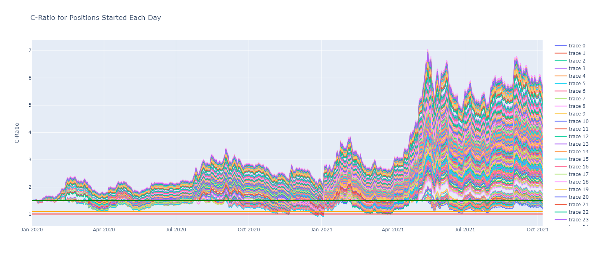

```python
import json, csv, datetime, pytz, math
import pandas as pd, numpy as np
import plotly.graph_objects as go
import main as main
```


```python
# import csv price data
ohlc = {
    "btcusd": pd.read_csv(r"data/BTCUSD.csv"),
    "ethusd": pd.read_csv(r"data/ETHUSD.csv"),
    "ethbtc": pd.read_csv(r"data/ETHBTC.csv")
}

# reformat datetime and set as index
for key in ohlc.keys():
    ohlc[key]["timestamp"] = ohlc[key]["timestamp"].astype("datetime64[ns, UTC]")
    ohlc[key].set_index("timestamp", inplace = True)

# init parameters for analysis
inputs = {
    "init c-ratio": 1.5,
    "courtesy call": 1.1,
    "liquidation": 1.01,
    "start date": datetime.datetime(2020,1,1).replace(tzinfo=pytz.utc),
    "end date": ohlc["btcusd"].index.max()
}

inputs["date_rng"] = pd.date_range(inputs["start date"], inputs["end date"])
```


```python
# load compressed json and benchmarks
with open("data/small_test.json", "r") as jf:
    test = json.load(jf)
benchmarks = main.get_benchmarks(inputs)
```


```python
# summarize
summary = main.summary(inputs, test)
summary_df = pd.DataFrame.from_dict(summary, orient = "columns")
summary_df.describe()
```


<div>
<style scoped>
    .dataframe tbody tr th:only-of-type {
        vertical-align: middle;
    }

    .dataframe tbody tr th {
        vertical-align: top;
    }

    .dataframe thead th {
        text-align: right;
    }
</style>
<table border="1" class="dataframe">
  <thead>
    <tr style="text-align: right;">
      <th></th>
      <th>Total Days</th>
      <th>Days Below Courtesy Call</th>
    </tr>
  </thead>
  <tbody>
    <tr>
      <th>count</th>
      <td>646.000000</td>
      <td>646.000000</td>
    </tr>
    <tr>
      <th>mean</th>
      <td>323.500000</td>
      <td>0.863777</td>
    </tr>
    <tr>
      <th>std</th>
      <td>186.628419</td>
      <td>3.693701</td>
    </tr>
    <tr>
      <th>min</th>
      <td>1.000000</td>
      <td>0.000000</td>
    </tr>
    <tr>
      <th>25%</th>
      <td>162.250000</td>
      <td>0.000000</td>
    </tr>
    <tr>
      <th>50%</th>
      <td>323.500000</td>
      <td>0.000000</td>
    </tr>
    <tr>
      <th>75%</th>
      <td>484.750000</td>
      <td>0.000000</td>
    </tr>
    <tr>
      <th>max</th>
      <td>646.000000</td>
      <td>36.000000</td>
    </tr>
  </tbody>
</table>
</div>


```python
liquidated = summary_df["Liquidated?"].loc[summary_df["Liquidated?"] == True].count()/summary_df["Liquidated?"].count()
print("% of Positions Liquidated = {}%".format(round(liquidated*100,2)))
```

    % of Positions Liquidated = 2.01%
    


```python
# uncomment to plot figure live
fig = go.Figure()

for date, position in test.items():
    fig.add_trace(
        go.Scatter(
            x = position["timestamp"],
            y = position["c-ratio"],
            mode = "lines"
            #name = position["timestamp"][0].format("%Y-%m-%d")
        ))
    
fig.add_trace(go.Scatter(x = inputs["date_rng"], y = benchmarks["init c-ratio"], line_color = "green", mode = "lines", name = "init c-ratio"))
fig.add_trace(go.Scatter(x = inputs["date_rng"], y = benchmarks["courtesy call"], line_color = "orange", mode = "lines", name = "courtesy call"))
fig.add_trace(go.Scatter(x = inputs["date_rng"], y = benchmarks["liquidation"], line_color = "red", mode = "lines", name = "liquidation"))
fig.update_layout(
    title = "C-Ratio for Positions Started Each Day",
    yaxis_title = "C-Ratio"
)
fig.write_html("live_plot.html")
```

See html file in repo for interactive chart



```python

```
